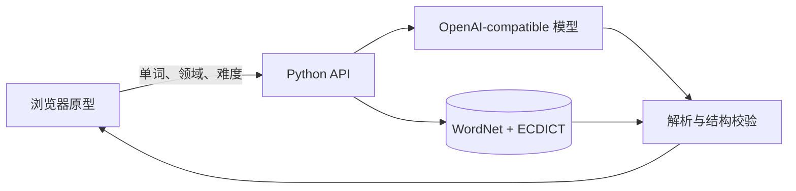

# 语境岛

> 输入一个英文单词，看懂它在你关心的语境里怎么用，也看懂整句话是怎么搭起来的。

语境岛是一款面向中文母语英语学习者的语境化查词原型。普通词典能告诉你一个词有哪些
含义，却很少解释它在特定句子里采用了哪个含义，以及整句话的主语、谓语、宾语和修饰
成分如何组织。语境岛把这几步放进同一张学习卡片：**中文释义、领域例句、整句翻译、
句子成分和精确英文义项**。

当前版本用于产品与交互验证，尚未作为线上服务发布。

## 它能做什么

- 根据产品经理、心理学、健身、咖啡等兴趣领域生成例句。
- 展示 ECDICT 整词中文释义和例句的中文翻译。
- 把英文句子拆成主语、谓语、宾语、定语、状语等成分。
- 在例句和成分列表中突出目标词。
- 用 WordNet 义项标明当前例句命中的精确词义。
- 对同一个词点击“再来一句”，生成不同例句。
- 播放预置样例的英式、美式单词录音和整句朗读。
- 对重复查询使用本地缓存，减少等待和模型调用。

## 快速开始

### 1. 准备环境

需要：

- Python 3.11 或更高版本
- 一个 OpenAI-compatible 模型服务的 API Key
- macOS 或 Linux；Windows 可使用 Git Bash 或 WSL

仓库已包含构建完成的本地词库，普通试用不需要安装 NLTK，也不需要重新下载词典。

### 2. 配置并启动后端

```bash
cd backend
cp .env.example .env
```

打开 `backend/.env`，填写自己的密钥：

```dotenv
LLM_API_KEY=你的_API_Key
```

示例配置默认使用阿里云百炼北京地域的 `qwen3.8-flash`。也可以在 `.env` 中更换
`LLM_BASE_URL`、`LLM_MODEL` 和 `LLM_RESPONSE_FORMAT`，接入其他兼容服务。

启动接口服务：

```bash
bash run_dev.sh
```

看到 `SentenceScope API: http://127.0.0.1:8767` 即表示后端已启动。

### 3. 启动原型页面

在项目根目录另开一个终端：

```bash
python3 -m http.server 8766 --bind 127.0.0.1 --directory design
```

浏览器访问 [http://127.0.0.1:8766/](http://127.0.0.1:8766/)。

不要直接双击 HTML 文件打开。使用本地网页服务可以避免浏览器拦截页面与接口之间的请求。

## 使用方法

1. 在右上角选择感兴趣的领域。
2. 输入一个英文单词，例如 `eval`、`iterate` 或 `scope`。
3. 点击“搜索”，等待词卡生成。
4. 先看“中文释义”，再结合例句和整句翻译理解用法。
5. 查看成分列表，理解句子的组织方式。
6. 展开英文义项，查看该词的其他含义。
7. 点击“再来一句”，在相同领域继续观察这个词的不同用法。

输入框目前接受单个英文单词，可包含连字符或撇号。词库中没有的词会明确提示，不会由
模型临时编造释义。

## 为什么释义更可信

语境岛把“词典事实”和“模型生成内容”分开处理：

- 中文整词释义来自 ECDICT。
- 英文义项及稳定编号来自 WordNet。
- 模型生成例句、整句翻译和句子成分，并只返回命中的 `sense_id`。
- 后端根据 `sense_id` 从本地词库回填释义；模型不能新增或改写词典义项。
- 生成结果必须通过 JSON 解析、原句拼接、标签集合、目标词和义项有效性校验。
- 校验失败时最多修正三次；仍不合格则显示失败状态，不展示伪造卡片。



## 项目结构

```text
.
├── design/
│   ├── index.html                 # 最新交互原型
│   ├── 观察指南.html              # 主持测试时使用
│   └── 录音来源.md                # 预置样例音频来源
├── backend/
│   ├── server.py                  # 本地 HTTP API 与模型调用
│   ├── core/                      # 数据模型、解析器与校验器
│   ├── data/
│   │   ├── lexicon.db             # 已构建的本地词库
│   │   ├── build_lexicon.py       # WordNet + ECDICT 构建脚本
│   │   └── *_LICENSE.txt          # 第三方数据许可
│   └── tests/                     # 离线测试
└── docs/                          # PRD、技术方案、实测报告与测试记录
```

## 运行测试

后端测试不需要 API Key，也不需要外网：

```bash
cd backend
bash tests/run.sh
```

当前共有 **74 项测试**，覆盖解析容错、义项校验、句子分段、固定语法标签、有限重试、
缺词处理、重复例句拦截、缓存和 ECDICT 导入。

## 当前数据与运行情况

| 项目 | 当前结果 |
| --- | --- |
| 可查询单词 | 83,119 |
| WordNet 英文义项 | 117,659 |
| 带中文释义的单词 | 82,108（98.78%） |
| 后端离线测试 | 74 项通过 |
| 已实测模型 | 阿里云百炼 `qwen3.8-flash` |
| 首次生成耗时 | 实测通常约 4–10 秒；校验重试时可能更久 |
| 重复查询 | 当前服务运行期间命中缓存，通常即时返回 |

## 当前限制

- 这是交互验证原型，登录、生词本、正式难度选择和线上部署尚未完成。
- 动态搜索结果的单词音标与真人录音尚未接入；目前只有预置样例带单词录音。
- 非目标片段的词性确定性标注尚未完成。
- 结构校验能保证数据完整和标签合法，不能完全替代人工判断每个语法成分是否准确。
- 中文释义是整词参考，不与每一条 WordNet 英文义项强行对应。
- GitHub Pages 只能托管静态页面；完整查词体验还需要部署 `backend/` 服务并配置模型。

## 数据来源与许可

- [WordNet 3.0](https://wordnet.princeton.edu/)：英文义项、词性和稳定的 synset 编号；
  许可原文见 [`backend/data/WORDNET_LICENSE.txt`](backend/data/WORDNET_LICENSE.txt)。
- [ECDICT](https://github.com/skywind3000/ECDICT)：整词中文释义、BNC 与 COCA 词频秩；
  许可原文见 [`backend/data/ECDICT_LICENSE.txt`](backend/data/ECDICT_LICENSE.txt)。

模型不会生成或补写词典释义。预置发音样例的来源和使用边界见
[`design/录音来源.md`](design/录音来源.md)。

## 进一步阅读

- [产品需求文档](docs/PRD_语境岛_V1.0.md)
- [技术适配声明](docs/技术适配声明_V1.0.md)
- [阶段一技术开发文档](docs/阶段一技术开发文档_V1.0.md)
- [部署体积实测报告](docs/部署体积实测报告.md)
- [交互测试记录](docs/交互测试记录.md)

如果你在体验中发现问题，建议同时记录：**使用的单词、选择的领域、执行的操作、实际
结果和期望结果**。这会比单独描述“结果不对”更容易复现。
